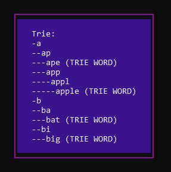
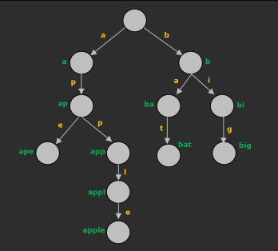
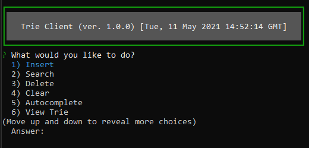
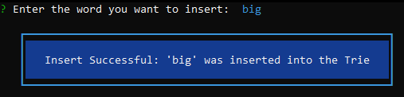
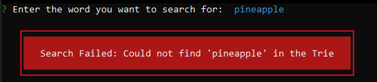

# trie-system
A Command Line Interface made with Node which can interact with a Trie hosted globally live on a Google Cloud server





A Trie is a type of search tree often called a prefix tree which stores keys through the use of nodes that hold individual characters.

The Trie used in this project is implemented in Javascript using nodes that contain a String character, boolean variable to keep track if it is an end word, and a Javascript Object to hold children references 

(Rationale behind using A Javascript Object is that it is near equivalent to that of a HashMap with O(1) lookup and insert .etc, however with Javascript, a HashMap is an instance of an Object, therefore an Object is more basic and allows for a performance boost in many cases)

# Installation

Install `npm` https://www.npmjs.com/get-npm

In your command line of choice, install the npm package `trie-system`

```bash
npm install -g trie-system
```

# Usage

In order to activate the CLI use the following command below

```bash
trie-system
```

The rest is mainly self-explanatory from there. You will be greeted by a menu with a variety of options to choose from to interact with the Trie on the server.



--------------------------------

The CLI currently supports the following operations:
- Insert
- Search
- Delete
- Clear
- Autocomplete
- View
- Exit





**You can only input words that contain only english letters. No special characters or spaces .etc**

Since the Trie is hosted globally on a server, it can be manipulated by multiple clients at the same time, so if another client performs operations at the same time as you, your operations may reflect different results than expected.

# Plans

This repository was made as part of a project with a time constraint, so currently I am not longer actively working on this project.

These are some potential ideas/plans I could've done with this:
- Change the Node in the Trie to hold a frequency integer variable instead of an isWordEnd boolean variable. Although it will increase the amount of memory used, it will allow duplicates to be stored in the Trie and allow for more capabilities and methods to be made.
- Change autocomplete to take into account the new frequency variable. We could take the current list being returned and sort it based on the frequency, mimicing more how many mainstream autocomplete features work. 
- Separate the server and client into different repos. Currently it is all in one and under a singular package.json. This leads to the package to be unnecessarily large due to extra dependencies and files.
