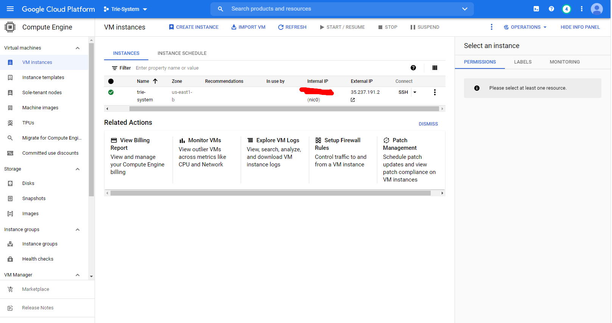
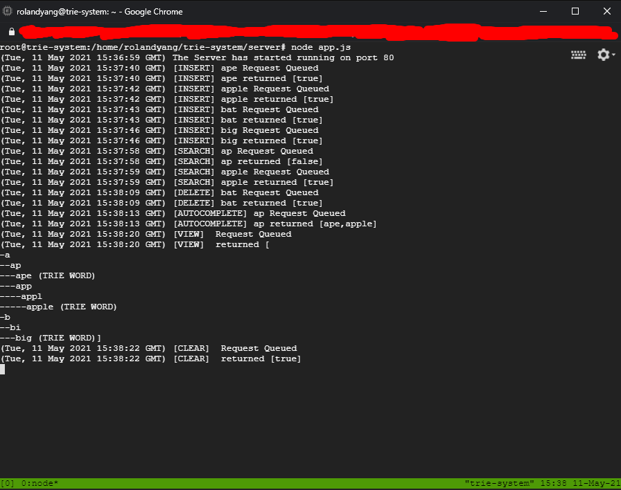

# Server

The server is hosted live on Google Cloud at http://35.237.191.2. 

It is run via an Express Node.js Server on a VM Instance.

In order to run it 24/7 without it closing out, the server is using tmux to run it on a separate terminal within the instance.





# CLI Interaction

The CLI interacts to the server though the use of HTTP Requests.

The client specificially makes use of fetch to do these requests.

Using the CLI, the user will choose what action they want to perform with the Trie and input any other information if necessary. Then the client sends a HTTP request to the server. The server adds this to a Queue. When the request is popped out of the queue it runs the action on the Trie which is stored in a global variable on the server. The response from the Trie method is then sent back to the client, which then interprets the results and displays a meaningful message reflecting the results.

# Routes

The server current supports the following operations via these routes:

**":word" represents the parameter for the input**

--------------------------------

##### GET

Search `/search/:word` Searches for a given word inside of the Trie. Returns true or false depending on if the word was found or not

Autocomplete `/autocomplete/:prefix` Gets words inside of the Trie that could potentially be autocomplete options for the given prefix

View `/view` Displays the Trie in a String representation

--------------------------------

##### POST

Clear `/clear` Clears the global Trie

Insertion `/insert/:word` Inserts a given word into the Trie. Returns true or false depending on if the word was inserted

Deletion `/delete/:word` Deletes a given word in the Trie. Returns true or false depending on if the word was deleted


# REST Endpoints

The following curl commands may be used to test REST calls to the server.

```bash
curl http://35.237.191.2/search/:word
curl http://35.237.191.2/autocomplete/:word
curl http://35.237.191.2/view/:word
curl -X POST http://35.237.191.2/clear
curl -X POST http://35.237.191.2/insert/:word
curl -X POST http://35.237.191.2/insert/:word
```